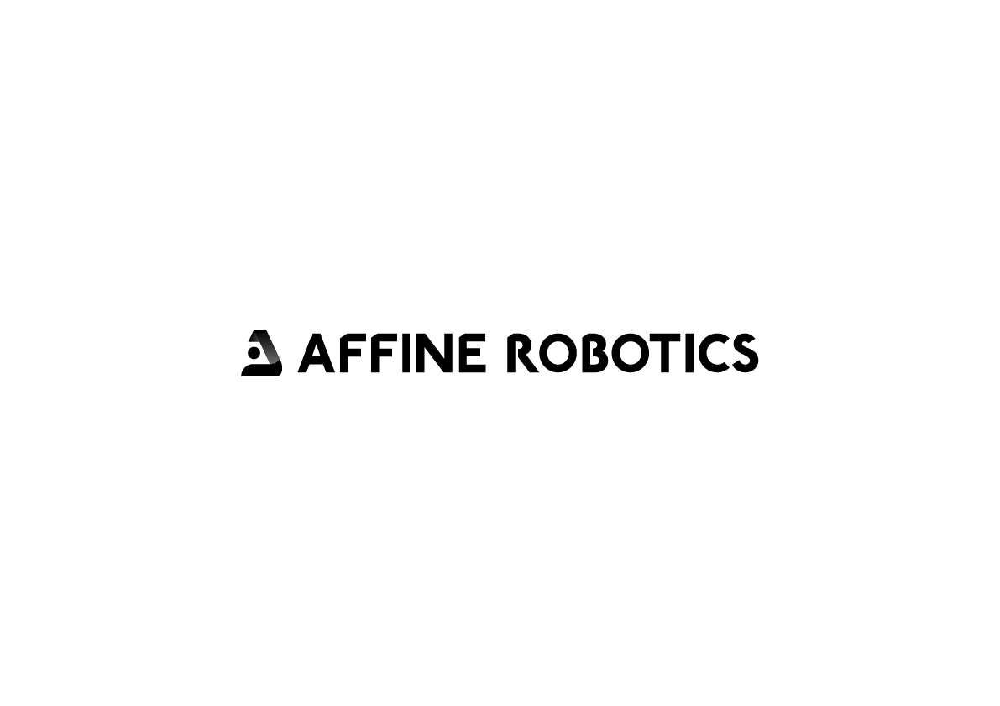

# Affine Robotics 허니팁스

로봇 시스템을 구성할때 유용한 정보를 공유하는 공간입니다. 

## DHCP

DHCP 서버를 이용하면 컴퓨터가 로봇에게 IP주소를 할당할 수 있습니다.

공유기를 통하지 않고 로봇과 컴퓨터를 직접 연결하므로 데이터 통신 오류를 최소화 할 수 있습니다.

## 파이썬 가상환경

파이썬을 이용하여 여러가지 프로젝트를 개발할 경우, 각 프로젝트에서 필요한 라이브러리간의 충돌이 발생할 수 있습니다. (버전 충돌 등)

가상환경을 이용하여 라이브러리 저장소를 프로젝트마다 개별적으로 관리하여 충돌을 피하거나, 필요에 따라 환경을 스위칭하며 개발을 쾌적하게 진행할 수 있습니다.

## VNC viewer

Universal Robots의 polyscope(티치팬던트) 화면을 컴퓨터에 미러링 할 수 있습니다.

개발 및 디버깅시 유용합니다.

## VScode

다양한 개발용 에디터들이 있지만, Github Copilot등 강력한 도구들을 이용하여 개발속도를 비약적으로 향상시킬 수 있습니다.

## WSL(Windows Subsystem for Linux)

상황에 따라 Windows환경에서 Linux 기반 프로그램을 동작시켜야하는 경우가 있습니다. 
WSL을 이용하여 Windows 상에서 가상의 리눅스 컴퓨터를 생성하고, 인터렉션 할 수 있습니다.
