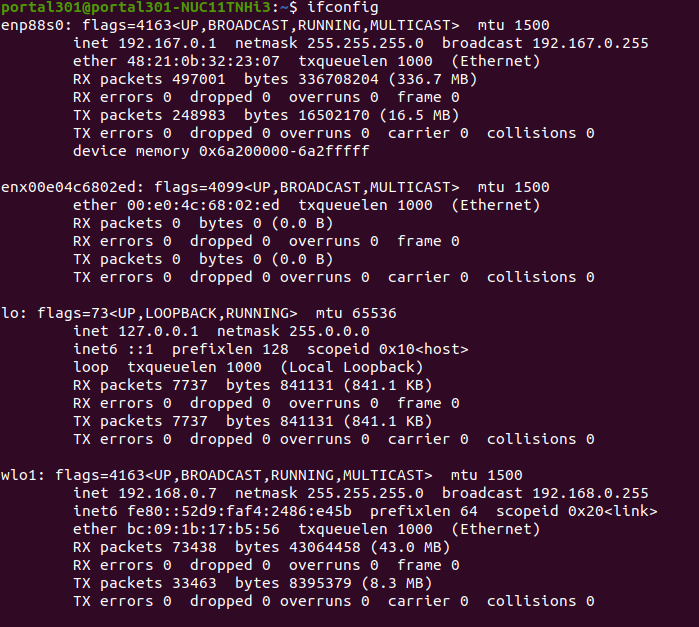
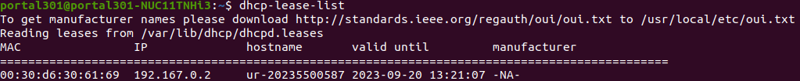
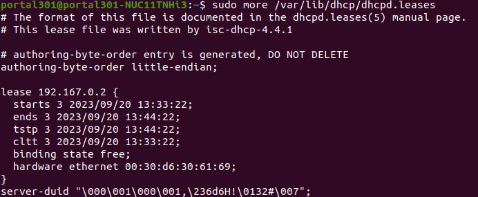
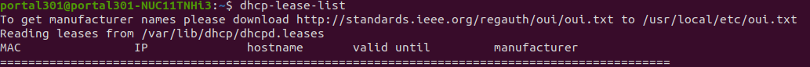

## ISC-DHCP-SERVER
Network bridge for devices/robots

           sudo apt-get update
           sudo apt-get upgrade
           sudo apt-get install isc-dhcp-server

1. Edit "dhcpd.conf"

           sudo nano /etc/dhcp/dhcpd.conf
In the file,:
           -------maybe changes not needed -------
           authoritative;
           default-lease-time 660;
           max-lease-time 6300;
           ----------------------------------------

           subnet 192.167.0.0 netmask 255.255.255.0{ --> [caution!] Most examples use 192.168.0.0 which is occupied by our wifi router(iptime)
             # range of subnet
             range 192.167.0.2 192.167.0.254
             # gateway address
             option routers 192.167.0.1
             # DNS server adddress (maybe not needed?)
             option domain-name-servers 8.8.8.8 8.8.4.4
           }
           
2. Edit "isc-dhcp-server"
First check the available ethernet interfaces(CLI: ifconfig)

--> In the test case below, "enp88s0" is an embedded ethernet, and "enx00e04c6802ed" is ethernet from an external usb-adapter.
Some examples uses interface names like eth0 and eth1, but those seem not to be used for the Ubuntu 20.04 LTS and later versions. 

   
Now open the isc-dhcp-server file to edit.

           sudo nano /etc/default/isc-dhcp-server

In the file, assign the interfaces

           INTERFACEv4="enp88s0"
           INTERFACEv6="enp88s0"

3. Assign IP address to the DHCP server

           ifconfig enp88s0 192.167.0.1

4. start/check
   
           sudo systemctl start isc-dhcp-server
           sudo systemctl enable isc-dhcp-server

           sudo service isc-dhcp-server restart  (...?)
           sudo service isc-dhcp-server status
           # tip - stop: sudo service isc-dhcp-server-stop

   
           # IP list assigned by DHCP server
           dhcp-lease-list

5. Assign static IP to the robot (This case changed the IP address of the robot just as a test.)

           sudo nano /etc/dhcp/dhcpd.conf
           ------------------------------------
           subnet 192.167.0.0 netmask 255.255.255.0 {
             range 192.167.0.2 192.167.0.100;
           
             #gateway address
             option routers 192.167.0.1;
             #DNS server address
             option domain-name-servers 8.8.8.8, 8.8.4.4;
           
             host ur5e {
               hardware ethernet 00:30:d6:30:61:69;
               fixed-address 192.167.0.3;
             }
           }
           ------------------------------------

### Trouble shooting

#### 1 dhcpd -t /etc/dhcp/dhcpd.conf  prints: /etc/dhcp/dhcpd.conf: interface name too long (is20)  
--> This test case got this error even after assigning ip to the server, but it is working properly, anyway.

#### 2 dhcp-lease-list returns nothing after assigning static address different from the previous dynamic ip (192.167.0.2 to 192.167.0.3(static)
When checked from the client side, the client (the ur5e robot, in this case) normally displayed static ip(192.167.0.3) which we intended to assign. 

The hints for this problem is here: https://serverfault.com/questions/955966/how-do-i-purge-dhcpd-leases

but not tried this time(I guess expiration of the lease would spontaneously solve it, and it's working anyway, and we are busy..!).

(screenshot of current state, even the static ip 192.167.0.3 is successfully assigned to the robot)

