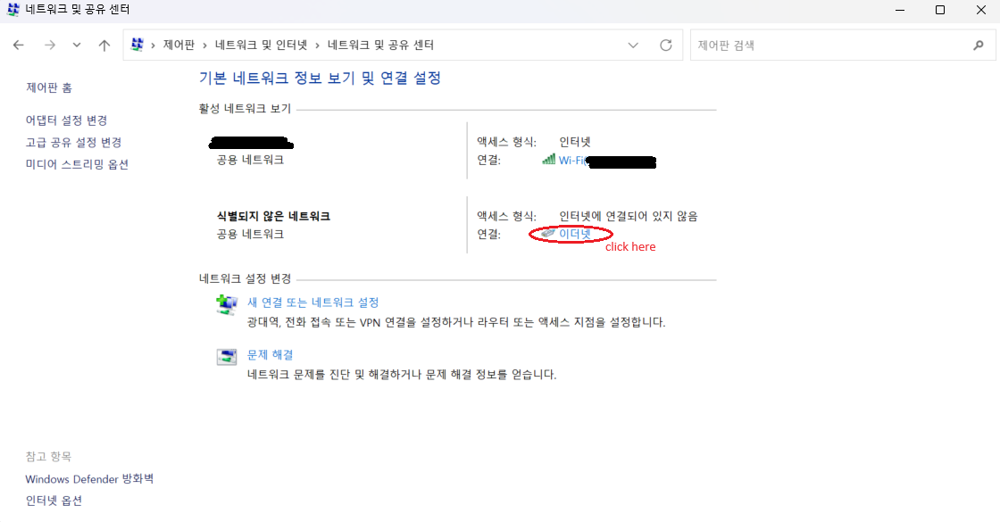
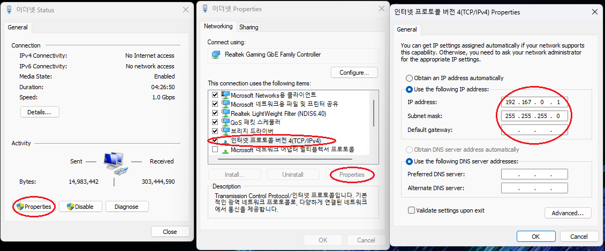
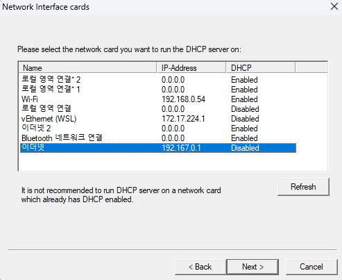

# DHCP server: assigning a static ip address to the robot
### 1. Setting Network
Go to: Control Panel>Network and Internet>Network and Sharing Center

On "Activated Internet" section, click ethernet as below. (If there's no ethernet displayed, connect LAN cable from the robot to computer)

Click properties(P), open the properties for Internet Protocol Version 4(TCP/IPv4), and set as below:

(주의사항: 차후에 해당 네트워크 어댑터를 통해 인터넷을 활용하고 싶으면 다시 설정을 되돌려야함)

### 2. DHCP Server for windows
Download DHCP server for windows here:  https://www.dhcpserver.de/cms/download/

This test used v2.5.2 which is the lastest version as of 9/25/2023

Following the manual(https://www.dhcpserver.de/cms/running_the_server/), install and start dhcpwiz.exe.

Find the ethernet with IP-Address = 192.167.0.1, and click next

If there is existing dhcpsrv.ini file, check 'Overwrite existing file' on the 'Writing the INI file section'.

After writing the .ini file, open 'dhcpsrv.ini' file, and edit as follows.

           [SETTINGS]
           IPPOOL_1=192.167.0.2-50
           IPBIND_1=192.167.0.1
           AssociateBindsToPools=1
           Trace=1
           DeleteOnRelease=1
           ExpiredLeaseTimeout=2592000
           
           [GENERAL]
           LEASETIME=1800
           NODETYPE=8
           SUBNETMASK=255.255.255.0
           NEXTSERVER=192.167.0.1
           ROUTER_0=0.0.0.0
           
           [DNS-SETTINGS]
           EnableDNS=0
           
           [TFTP-SETTINGS]
           EnableTFTP=0
           WritePermission=0
           
           [HTTP-SETTINGS]
           EnableHTTP=0
           
           [00-30-D6-2D-2F-A3]; MAC address of the kari robot
           IPADDR=192.167.0.3

For, detailed description, see here: https://www.dhcpserver.de/cms/ini_file_overview/

Run the DHCP server by clicking "Admin ..." button on the 'DHCP configuration completed' section.

If the setup process is successfully completed, we can just start the DHCP server by 'dhcpsrv.exe' instead of 'dhcpwiz.exe'.

### Tip
The MAC address can be found by checking 'dhcptrc.txt' file.

           [09/25/2023 19:29:06] Adapter 0 has recognized an incoming DHCP request
           [09/25/2023 19:29:06] DHCP message = DHCPREQUEST
           [09/25/2023 19:29:06]    requested options: 1 2 3 6 12 15 26 28 42 44 47 119 121
           [09/25/2023 19:29:06] Matching scope found for 192.167.0.3, index=1
           [09/25/2023 19:29:06] Lookup client data for physical address "00-30-D6-30-61-69" / client_id "00-30-D6-30-61-69"   ---> This is the MAC address.
           [09/25/2023 19:29:06] Client 00-30-D6-30-61-69 is configured with the IP address 192.167.0.3
           [09/25/2023 19:29:07] Response: hand out the configured IP address (lease time = 1800)
           [09/25/2023 19:29:07] Sending a unicast response to the client ciaddr=192.167.0.3

