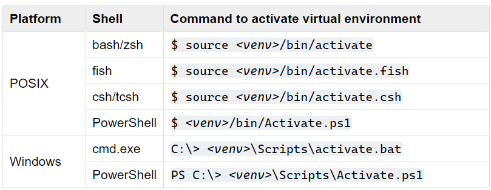

#### Python virtual environment(venv)
python virtual environment setup: https://docs.python.org/3/library/venv.html

- Ubuntu bash/zsh

        python -m venv venv_name

        source venv_name/bin/activate

- Windows bash

        python -m venv venv_name

        venv_name\Scripts\activate.bat

- Windows CMD

        python -m venv venv_name
  
        venv_name\Scripts\activate.bat    (use '\', not '/')

To deactivate current environment, 

        deactivate
        
