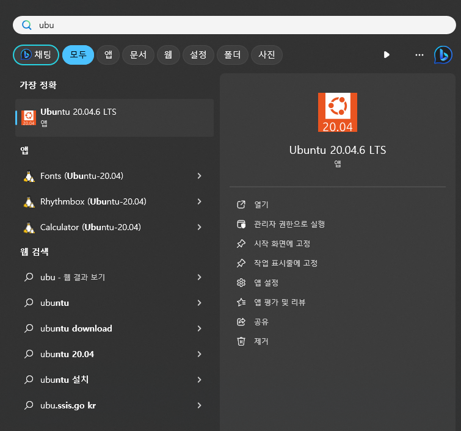
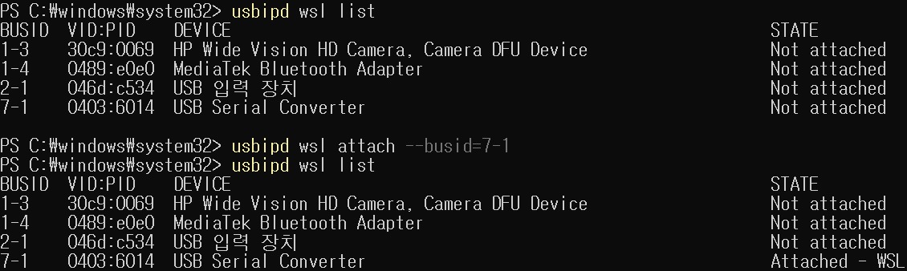

## WSL:Ubuntu(20.04 LTS) in Windows
* Setup process for UR-RTDE is difficult for windows. --> If you need to install ur-rtde on windows, use wsl.

* Frequently used WSL commands
           wsl --shutdown


### 1. WSL installation (windows 11 home)
         * setup guide: https://velog.io/@darktrace1/%EC%9C%88%EB%8F%84%EC%9A%B011%EC%97%90-UbuntuWSL2-%EC%84%A4%EC%B9%98%ED%95%98%EA%B8%B0
         
         * tip: ubuntu user account (https://dlehdgml0480.tistory.com/6)
         
                  sudo adduser <username>
                  
                  sudo adduser <username> sudo
                  
                  whoami
                  
                  su <username>
         
         
         * Encounted errors:
           
           [1] Windows 10 / Windows 11 에서 WSL 로 Ubuntu 실행 시, 0x800701bc 에러가 발생할 수 있는데, WSL2 Linux Kernel Update 를 설치해주면 해결된다.
           
                  다운로드 링크: https://wslstorestorage.blob.core.windows.net/wslblob/wsl_update_x64.msi
           
           [2] Windows 기능 켜기/끄기 - https://velog.io/@jaylnne/WSL-Error-0x80370102-%ED%95%B4%EA%B2%B0
           
                    Hyper-V 관련 설정은 "하이퍼바이저"로 이름이 다르게 표시될 수도 있는 듯.

 

### 2. WSL GUI

best reference: https://guiyomi.tistory.com/113

"오류해결" 섹션도 볼 것.

* Activating Ubuntu:



납품되는 omen 진입 방법 및 설정

1. wsl 내부에서 xrdp 실행
```
wsl -d Ubuntu-20.04                      (파워쉘 등 터미널에서  WSL 진입)
sudo /etc/init.d/xrdp start              (xrdp 원격 데스크톱 실행)
```
2. 윈도우에서 원격 데스트톱을 통해 접속
```
원격 데스크톱 실행 (remote desktop connection)
컴퓨터: localhost:3390
사용자 이름: kariadmin
비밀번호: kari                       (원격 데스크톱 진입 후 사용)
```
### 3. USBIPD & UDEV: Sharing USB connection from Windows to WSL
  
Setup guide: https://github.com/dorssel/usbipd-win

Error support: https://github.com/dorssel/usbipd-win/wiki/WSL-support

User's blog: 

[1] https://velog.io/@mythos/Windows-WSL2-USB-%EC%9E%A5%EC%B9%98-%EC%97%B0%EA%B2%B0%ED%95%98%EA%B8%B0

[2] https://velog.io/@pikamon/Linux-6)

* Windows -> usbipd:

           winget install --interactive --exact dorssel.usbipd-win
  
* WSL(Ubuntu) -> usbip tools :

           (wsl을 새로 켰으면 해당 세팅을 다시 해야함)
           sudo apt install linux-tools-5.4.0-77-generic hwdata
           sudo update-alternatives --install /usr/local/bin/usbip usbip /usr/lib/linux-tools/5.4.0-77-generic/usbip 20

* Back to Windows,

           (해당 세팅은 dynamixel과 usb연결이 되어 있는 상태에서 실행)
           usbipd wsl --help
           usbipd wsl list
           usbipd wsl attach --busid=<BUSID>

* The following screenshot is catured from the test case.



#### Trouble shooting
※ 주의. WSL2 게스트 리눅스 콘솔을 켜놓지 않고 명령어를 입력하면 아래와 같이 에러가 출력되므로, 콘솔을 켜놓고 실행해야 한다.

           usbipd: error: The selected WSL distribution is not running; keep a command prompt to the distribution open to leave it running.

※ 주의. 위의 update-alternatives 명령을 실행하지 않으면 아래와 같이 에러가 출력된다. --> You may need to execute this whenever reboot the WSL2.

           usbipd: error: WSL 'usbip' client not correctly installed. See https://github.com/dorssel/usbipd-w

### (Additional) UDEV: allowing usb connection to non-root users

         cd /etc/udev/rules.d
         
         sudo nano 99-usb-serial.rule
         
         save the below:
         -------------------------------
         SUBSYSTEM=="tty|usb", MODE="0666"
         -------------------------------
         
         sudo udevadm control --reload-rules

unplug & plug the usb device(serial usb in this case) again.

About udev rules

" ... Files are run in sort-order. So, to make your rules file the last to be read, overriding earlier ones, try a name like 99-instruments.rules. "
(https://unix.stackexchange.com/questions/111593/allow-non-root-user-to-read-write-dev-files)
-udev rule example: https://github.com/arduino/OpenOCD/blob/master/contrib/60-openocd.rules

* not tried, but recommend to read
  
title: Linux usb devices (udev) 에 대한 이름 부여(ttyUSB* 에서 *가 매번 바뀌는 것을 방지)

https://m.blog.naver.com/PostView.naver?isHttpsRedirect=true&blogId=rlackd93&logNo=221312677996


## Additional Information

### Ubuntu System Backup and Restore - Timeshift

https://ko.linux-console.net/?p=11154#gsc.tab=0
